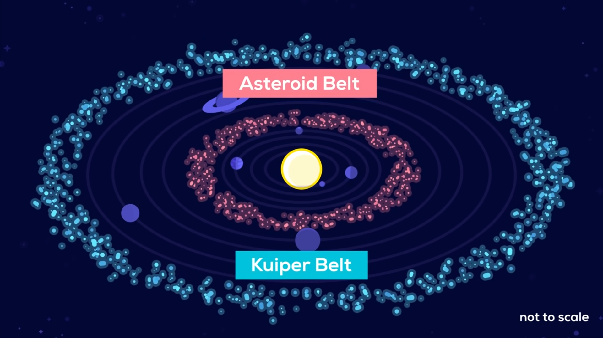

# From Kurzgesagt to the Cosmos

Inspired by Kurzgesagt's thought-provoking video ["Unlimited Resources from Space - Asteroid Mining,"](https://youtu.be/y8XvQNt26KI?si=q1j5XdSpt_Xu1wKL) this repository embarks on a real-world exploration of celestial resource extraction. Fueled by data from NASA's Jet Propulsion Laboratory, we'll delve into the practicalities of mining these celestial treasure troves.

Forget Earth's limitations! This repository is a dedicated space for answering the burning questions about asteroid mining:

    > Which asteroids hold the most lucrative loot? 
    We'll crack open datasets and utilize sophisticated models to identify the most promising space rocks for mining operations.
    
    > Can we actually turn a profit among the stars? 
    Economic feasibility analysis will be our compass, guiding us towards financially viable space ventures.
    
    > How do we get from Earth to payday? 
    From mission planning to logistical challenges, we'll chart a course for efficient and cost-effective asteroid exploration and resource extraction.

Ready to launch your inner space entrepreneur? Dive into the code and let's turn science fiction into reality!

P.S. This is no solo mission! Don't forget to star this repository and join the discussion! I'm eager to welcome new crewmates on this celestial adventure.

***

# Acknoledgements

1. This project would not exist without Kurzgesagt. Although, the YouTube channel isn't directly involved with this project, it is heavily inspired from their work. Most of the resources used to study about asteroids and feasibility of mining from them was directly sourced from their video's shownotes. 

2. As a graduate student of University of Rochester, I am greatly indebted to my teachers for arming me with the knowledge required to perform the analytical and technical aspects of this project. In particular,

    * Thank you to **Prof. Anson Kahng**. He was my instructor for the course **Computational Introduction to Statistics**. I learnt a great deal of descriptive and inferential statistics from this course and I rely on these techniques heavily on this project.

    * Thank you to **Prof. Jiebo Luo** who was my instructor for the **Data Mining** course. A great deal of care was taken to deal with the noisy asteroid dataset. From dealing with missing values to using methods to mine patterns in data, I learnt from him. 

    * Thanks to my **Natural Language Processing** instructor **Prof. Hangfeng He**. Although I didn't use NLP techniques directly here, I did use deep learning which I learnt from his course.

3. Last but not least, thank you to the folks at NASA for open-sourcing the small-body dataset. It's mindblowing to think anyone can access such high quality data about celestial objects and gather information from it!

(<a href="#from-kurzgesagt-to-the-cosmos">back to top</a>)
